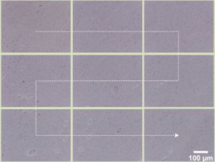

# Autofocus in 10x

This project is the implementation of an algorithm which automates the focusing processes of a microscope
 
 ## Installations 
 install cv2 library as we are going to be using this mainly for the computer vision part.

 Now there are two ways of installing the cv2 library:

 * install the main modules package:
 ```bash   
    $pip install opencv-python
 ```
 *  Full package:
 ```bash
    $pip install opencv-contrib python  
 ```
 I've installed all the packages and the pi documentation also recommends you to use the second method.

 The PySerial library can be installed similarly:
 ```bash
    $pip install pyserial
 ```
 The rest of the libraries are preinstalled(assuming numpy has already been installed by the user)

 ## Functions
 initialize the arduino us port by using the command:
 ```python
    ser=serial.Serial('/dev/ttyUSB0',9600,timeout=1)
 ```

 We store it as a variable as it acts as a channel through which we communicate with the Arduino.
 We also use the sleep command as a way of telling the PI4 to wait for sometime before excecuting the next command 
 ```python
 def movexclock(distance):
	if __name__== "__main__" :
		camera.start_preview()
		ser.reset_input_buffer()
		command = "xclk,{}".format(distance)
		ser.write(command.encode("utf-8"))
 ```  
 Let me explain what this block of code does:
 ```python
 if __name__== "__main__" :
 ```
 We write the communication command lines nested under this if statement so that the command is run only when it goes throught he main python interpreter.
 ``` python
 camera.start_preview()
 ```
 It lets you see in real time what your commands are actually doing to the machine.  A live stream of the camera connected to the Pi4 appears on your computer
 ```python
 ser.reset_input_buffer()
 ```
 The data is sent in byte sized chunks called buffers so this line clears the data and resets it for a new run.
 ```python
    command = "xclk,{}".format(distance)
    ser.write(command.encode("utf-8"))
 ```
 This block is for the clockwise rotation of the motors which are responsible for movement of the platform in the x-direction. The ser.write command is used to communicate with the arduino and give input to the serial moniter of Arduino which then gives the command to move the motors.

The other functions below this are similar to this one in terms of functioanlity and the methodss used.

```python
def variance(image):
	bg=cv2.GaussianBlur(image,(11,11),0)
	v=cv2.Laplacian(bg,cv2.CV_64F).var()
	return v
```
The variance function 

Let us come to the auto() function:

```python
if __name__ == '__main__':
   z=[]
   var=[]
   l=0
   camera.start_preview()
   ser.reset_input_buffer()
   sleep(1)
   camera.resolution=(320,240)
   camera.framerate=24
   ser.write("zcclk,12250".encode("utf-8"))
   sleep(30)
```

We initialize arrays to store the z position, the variance of the image and the current z position or the position to which the microscope will move to get the most focused image. This step is explained later in the code.

```python
   for i in range(21):
      image=np.empty((240*320*3),dtype=np.uint8)
      camera.capture(image,'bgr')
      image=image.reshape((240,320,3))
      camera.capture("/home/pi/Downloads/10x/New/image{0}({1}).jpg".format(i,variance(image)))
      var.append(variance(image))
      ser.write("zcclk,50".encode("utf-8"))
      sleep(1)
```
This loop moves the platform by 50 fine motor steps in each iterations, takes a picture, calculates the variance and store the value in an array for future reference(debugging etc). The number of iterations are 21 so the platform moves for about 1050 steps approximately( taking into account the energy losses due to friction and slipping of belt, we can only approximate).


```python
   var=np.array(var) 
   l=np.argmax(var)
   sleep(2)
   a="zclk,{}".format(1050-l*50)
   ser.write(a.encode("utf-8"))
   camera.resolution=(1920,1088)
   sleep((1050-l*50)/400+2)
   camera.capture("/home/pi/Downloads/10x autoscan/test3/focusedimage.jpg")
   sleep(2)
   print(var)
```
We then convert the array which stored the variances of the images in each iteration into a numpy array so that we can find the maximum of the array and its index easily (with the argmax() method)
Then we calculate the number of steps to reach the optimum focus position using a simple formula and send the signal to Arduino. We then capture the final image and store it in our computer. Print the variance array for reference.

Note: The sleep() command is important as the response time of Arduino is not ~0 but almost close to 60 ms (in the device with which I have worked). Hence we need to give some time before we excecute the next command, else th next command overwrites the previous one and it may cause disruption in the overall process.

```python
def auto3(i,j):
	z=[]
	var=[]
	l=0
	if __name__=="__main__":
      camera.resolution=(320,240)
		camera.framerate=24
		ser.reset_input_buffer()
		ser.write("zclk,200".encode("utf-8"))
		sleep(1)
		for i in range(11):
			camera.start_preview()
			image=np.empty((240*320*3),dtype=np.uint8)
			camera.capture(image,'bgr')
			image=image.reshape((240,320,3))
			var.append(variance(image))
			ser.write("zcclk,50".encode("utf-8"))
			sleep(1)
		#wait for one second so that chance of command overlap minimizes
		sleep(1)
		var=np.array(var) 
		l=np.argmax(var)
		a="zclk,{}".format(550-l*50)
		ser.write(a.encode("utf-8"))
		camera.resolution=(1920,1088)
		sleep((550-l*50)/400+2)
		camera.capture("/home/pi/Downloads/10x autoscan/blood/imagerow{0},{1}.jpg".format(i,j))
		sleep(1)
		print(var)
```
This function is extremely similar to the original auto function, the only difference being the range of motion. This function conducts the autofocus procedure are a particular point so we dont need a huge range for the platform to cover as there is a time constraint and also as the image gets only slightly defocused so we only need to check only a few points. This is why it moves 200 steps below and then climbs a total of 500 steps(300 above starting) which is sufficient.
```python
def scan():
	if __name__=="__main__":
      s=0
		m=0
		for i in range(10):
			for j in range(10):
				if(i%2==0): #change direction for each y movement
					movexclock(15)
				else:
					movexanticlock(15)
				
				sleep(1)
				if (j%5==0 and i>0): # autofocus on every 5th frame
					auto3(i,j)
				else:
					#capture and save
					camera.resolution=(1920,1088)
					camera.capture("/home/pi/Downloads/10x autoscan/blood/imagerow{0},{1}.jpg".format(i,j))
			
				
			movey(20)
			sleep(1)	
		#move back to the bottom 
		ser.write("zclk,13000".encode("utf-8"))
```
This function is for scanning the slide. We use a main loop for the y movement and a nested loop for the x movement. for every odd y we change the direction of the motor so that the final movement lookes like this. We also put an if statement for the auto3() which causes the microscope to autofocus every 5th frame instead of every frame(iteration). This saves as time as the images in the middle do not deviate significantly. 


## Final implementation

Now that we've seen the functions to be used, let us implement it.

```python
init()	
sleep(10)
auto()
sleep(1)
scan()
```
We initialize the device, as in , bring it to our origin and give it 10 seconds to complete its movement( calculated through trail and error). Then, we start the auto() function which moves to the most focused vertical position for that point. Finally we implement the scan position which implements a snake by row path of excecution as explained in the functions section above and looks like this :



## Conclusion
This code is a an implementation of an algorithm when the lens in the microscope is 10x. On running this code using raspberryPi which is connected to a functioning Arduino board and the main microscope, we attained a freqency of 10 scanned images per hour.
 